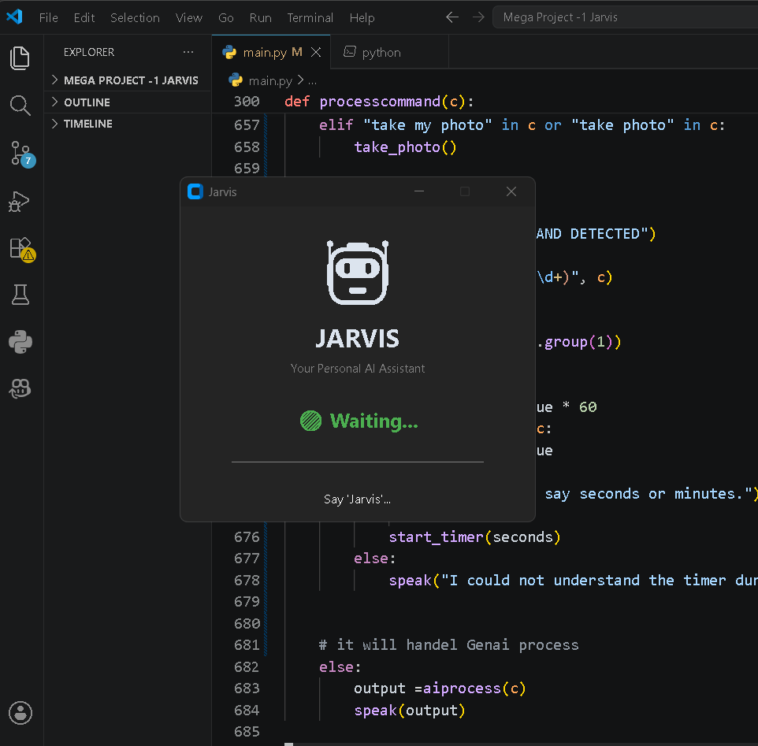
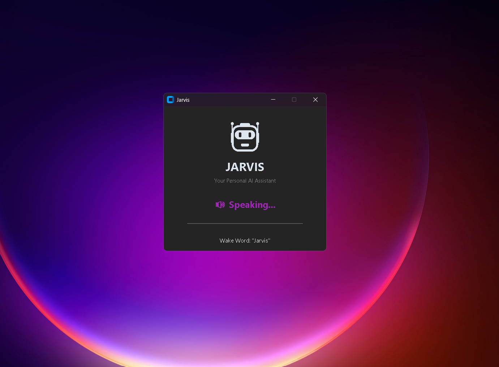
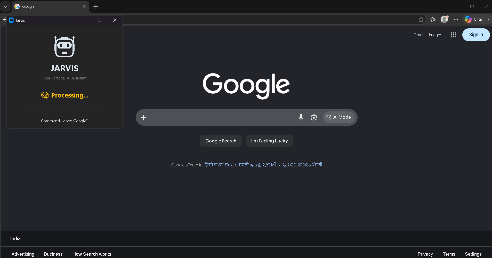

# 🤖 Jarvis AI Assistant

A modern voice-controlled desktop assistant built with Python and CustomTkinter.

Jarvis listens for the wake word **"Jarvis"**, understands voice commands, automates Windows tasks, controls system settings, opens applications, interacts with AI using Google's Gemini API, and provides a modern desktop interface with real-time status updates.

---

## 📸 Screenshots

### Home Screen



---

### Voice Interaction



---

### Browser Automation



---

# ✨ Features

## 🎙 Voice Assistant

- Wake word detection ("Jarvis")
- Speech Recognition
- Text-to-Speech responses
- Real-time UI status
- Command display

---

## 🖥 Modern Desktop UI

- CustomTkinter Interface
- Animated Robot
- Live Status

Status includes:

- 🟢 Waiting
- 🎤 Listening
- 🧠 Processing
- 🔊 Speaking
- ⚡ Executing

---

## 🌐 Browser Automation

Open websites instantly:

- Google
- YouTube
- Facebook
- LinkedIn
- GitHub
- ChatGPT

Example:

> "Jarvis, open Google"

---

## 💻 Windows Automation

Launch applications using voice:

- Visual Studio Code
- Chrome
- WhatsApp
- Camera
- Notepad
- Command Prompt
- File Explorer

---

## 📂 File Navigation

Open system folders:

- Desktop
- Downloads
- Documents
- Pictures
- Videos
- Music

---

## ⚙ System Controls

- Lock Computer
- Shutdown Computer
- Restart Computer
- Open Task Manager

Safety confirmation is required before shutdown or restart.

---

## 🔊 Volume Control

Supports:

- Increase Volume
- Decrease Volume
- Maximum Volume
- Minimum Volume
- Mute
- Unmute
- Set Volume to X%

---

## 💡 Brightness Control

Supports:

- Increase Brightness
- Decrease Brightness
- Maximum Brightness
- Minimum Brightness
- Current Brightness
- Set Brightness to X%

---

## 📷 Camera

Voice controlled:

- Open Camera
- Take Photo

Features:

- Face Detection
- Countdown
- Camera Flash
- Shutter Sound
- Automatic Desktop Save

---

## 📸 Screenshot Utility

Take screenshots using voice.

Features:

- Countdown
- Flash animation
- Camera sound
- Automatic Desktop Save

---

## 📰 News

Reads latest headlines using the GNews API.

---

## 🌤 Weather

Fetches live weather information.

Example:

> Weather in Pune

---

## ⏰ Timer

Examples:

- Set timer for 30 seconds
- Set timer for 5 minutes

---

## 🎵 Music

Supports:

- Built-in playlist
- YouTube search
- Automatic playback

---

## 🔋 Battery Information

Reports current battery percentage.

---

## 📅 Date & Time

Supports:

- Current Time
- Today's Date

---

## 🧠 Gemini AI Integration

Unknown commands are automatically forwarded to **Google Gemini AI**, allowing Jarvis to answer general questions naturally.

---

# 🛠 Technologies Used

- Python
- CustomTkinter
- SpeechRecognition
- pyttsx3
- OpenCV
- PyAutoGUI
- psutil
- pycaw
- screen-brightness-control
- Requests
- Google Gemini API
- dotenv
- pywhatkit

---

# 📁 Project Structure

```
Jarvis
│
├── app.py
├── main.py
├── client.py
├── musicLibrary.py
├── ui/
├── assets/
├── screenshots/
├── requirements.txt
└── README.md
```

---

# 🚀 Future Improvements

- Weather UI Cards
- Music Player Window
- AI Chat History
- Reminder System
- Calendar Integration
- Email Automation
- Face Recognition Login
- System Monitoring Dashboard

---

# 👨‍💻 Author

**Suraj Matole**

Computer Engineering Student

Python • AI • Automation • Machine Learning

GitHub:
https://github.com/Surajmatole